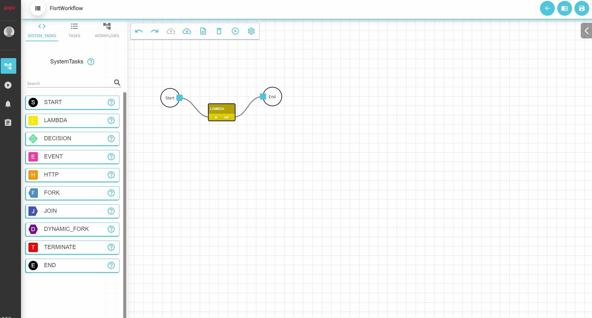

# 🎨 Building workflows

### Creating a new workflow

To create a new workflow, click on the Add button, configure your desired tasks sequence, fill in the general information, set the workflow name and then save it.


**Note**: Workflow name is required and must be unique. Keep in mind that the name cannot be changed later compared to the general parameters which are optional and can be changed at any time.


### Adding tasks

To add a new task on the canvas, find the element that meets your requirements between System Tasks, Custom Tasks, and Workflows in the left menu and add it to the drawing area using drag and drop. To connect the tasks, drag a line from the out port of one task and drop it to the input port of the other task.

### Configuring task parameters

To edit or add task parameters, double-click on the task and navigate through the tabs until you fill in all the desired input elements


Input parameters can be declared as: `${workflow.input.lambdaValue}`\
Variable provided by the other task: `${<taskRefName>.output.result}`


### `Lambda`

Lambda task, helps users to execute ad hoc logic at Workflow runtime using Javascript evaluation engine.

### `Decision`

Decision task works by evaluating either a single parameter or an entire expression. After evaluating the returning value, the workflow will follow the corresponding decision case. First of all, define the parameters which the decision process should take into consideration and then write the logic. Please follow the example below:

### Fork and JOIN

The 'Fork' function is used to schedule a parallel set of tasks. A Join task is needed to wait for the completion of all the tasks spawned by fork task and aggregate the outputs in a single Json object.


A Join Task **MUST** follow a Fork Task


### Http

An Http task is used to make calls to another microservice over HTTP. There can be used all the methods like GET, PUT, POST, DELETE and there can be configured custom headers depending on the type of the call.

### Terminate

This task can terminate a workflow with a given status and modify it's output with a given parameter. It can act as a "return statement" for conditions where you simply want to terminate the workflow.

