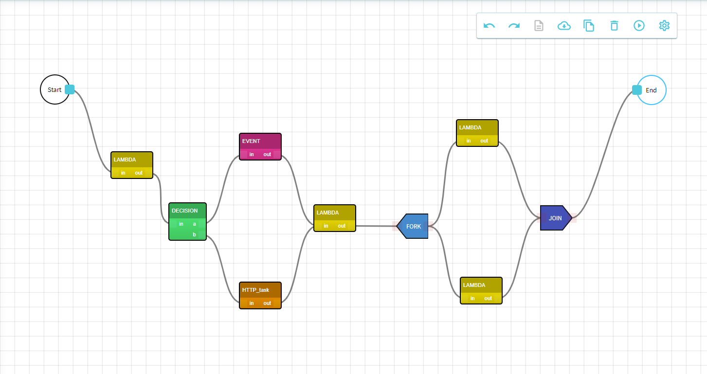

<h1 align="center">
  This project was built to help you describe the sequentiality of your process tasks without having any programming capabilities.
</h1>

## Prerequisites:

• Visual Studio Code: https://code.visualstudio.com/download 
• Git: https://git-scm.com/download/win  
• Git Extensions: https://github.com/gitextensions/gitextensions/releases  
• Node.js: https://nodejs.org/en/download/

## Start project in development:

Clone repositories from: 
• [https://dev.azure.com/totalsoft/LSNG_CONDUCTOR/\_git/Atlas](https://dev.azure.com/totalsoft/LSNG_CONDUCTOR/_git/Atlas) (Frontend) 
• [https://dev.azure.com/totalsoft/LSNG_CONDUCTOR/\_git/Atlas-gql-mesh](https://dev.azure.com/totalsoft/LSNG_CONDUCTOR/_git/Atlas-gql-mesh) (Gql-Mesh)

Set up Elastic by running the following commands in a Powershell terminal/command prompt:

    $env:KUBECONFIG=[insert path to the kubeconfig file for QA]
    kubectl port-forward svc/elasticsearch-master [portNumber]:9200 -n elastic

## Start the project

Run the following commands to start the projects:

### `npm install`

### `npm start`

This will start up the apps on:  
• [http://localhost:3000](http://localhost:3000) - React app  
• [http://localhost:5000/graphql](http://localhost:5000/graphql) - GQL-Mesh  
• [http://localhost:9000](http://localhost:9000) - Elastic

## Check out the application from QA:

• [https://leasing-atlas.appservice.online](https://leasing-atlas.appservice.online) (QA)

## Example of workflow

